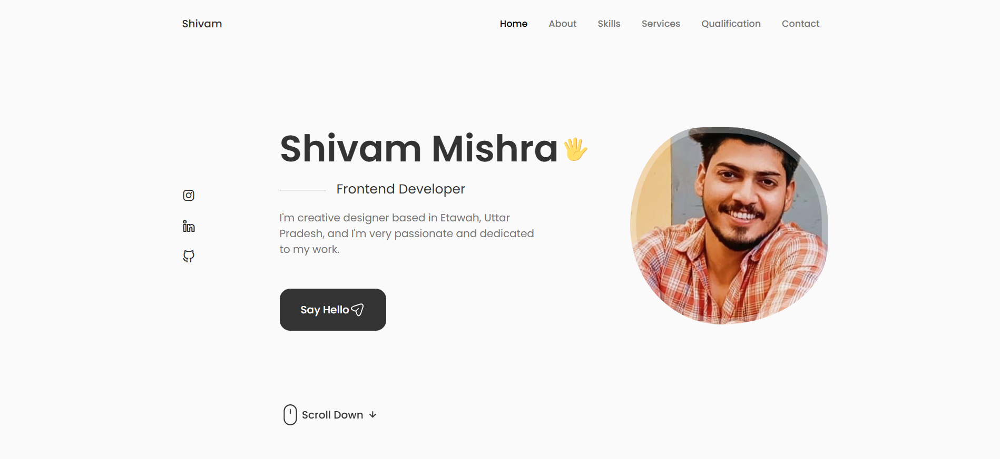
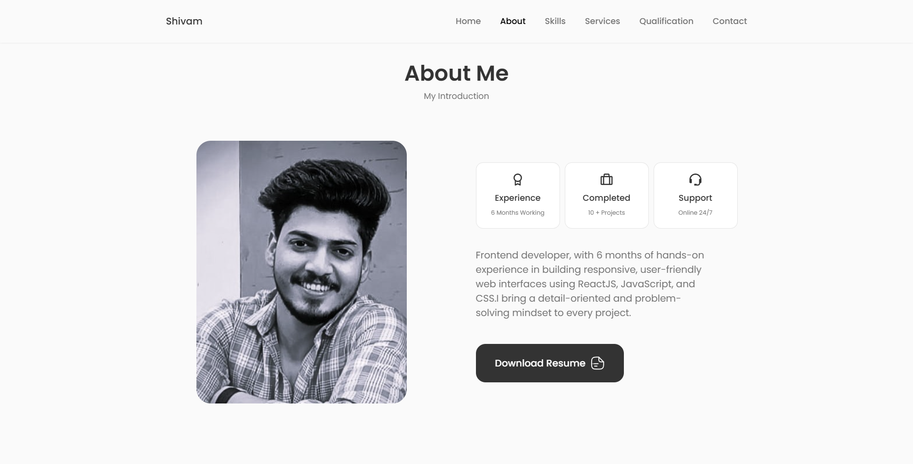
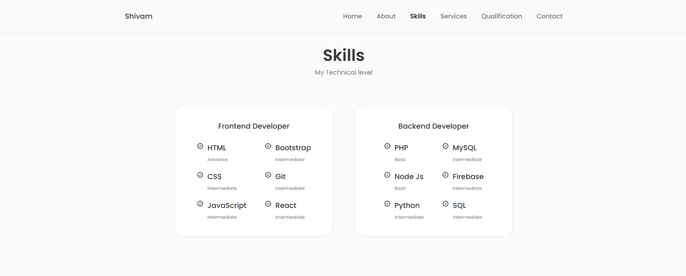
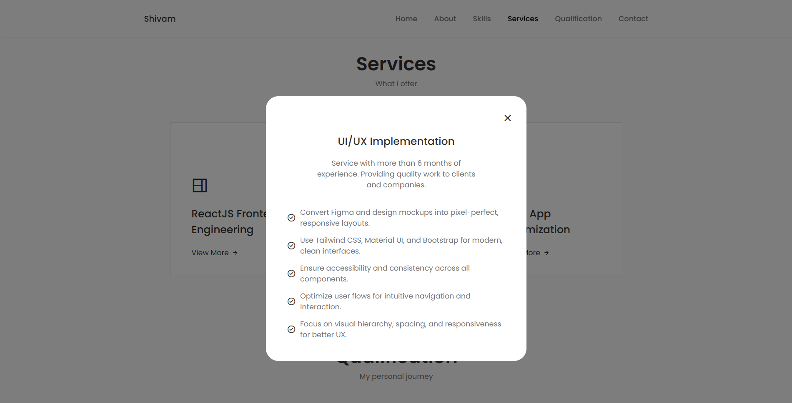

# Shivam's Portfolio Website

This repository contains the source code for my personal portfolio website. The website showcases my skills, projects, and experiences as a web developer.

## Features

- **Responsive Design**: Fully responsive and optimized for all devices.
- **Modern Technologies**: Built using React and Vite for fast performance and a smooth development experience.
- **Interactive UI**: Includes animations and interactive elements to enhance user experience.
- **Project Showcase**: Displays a collection of my best projects with descriptions and links.
- **Contact Form**: Allows visitors to get in touch with me directly through the website.

## Technologies Used

- **React**: For building the user interface.
- **Vite**: For fast development and optimized builds.
- **CSS/SCSS**: For styling the website.
- **EmailJS**: For handling contact form submissions.

## Screenshots

Here are some screenshots of the portfolio website:

1. **Homepage**  
   

2. **About Section**  
   

3. **Services Section**  
   

4. **Projects Section**  
   

5. **Contact Section**  
   

6. **Responsive Design (Mobile View)**  
   

7. **Interactive Animations**  
   

8. **Project Details Modal**  
   

9. **Footer Section**  
   

## Getting Started

To run this project locally, follow these steps:

1. Clone the repository:
   ```bash
   git clone https://github.com/Shivamt7/shivam-portfolio.git
   ```
2. Navigate to the project directory:
   ```bash
   cd shivam-portfolio
   ```
3. Install dependencies:
   ```bash
   npm install
   ```
4. Start the development server:
   ```bash
   npm run dev
   ```

## Deployment

The website is live and accessible at: [Shivam's Portfolio](https://shivam-portfolio-react.netlify.app/)

## Contact

If you have any questions or feedback, feel free to reach out to me:

- **Email**: shivam.s.mishra7@gmail.com
- **LinkedIn**: [Your LinkedIn Profile](https://www.linkedin.com/in/shivammishra7/)
- **GitHub**: [Your GitHub Profile](https://github.com/Shivamt7)

---

Thank you for visiting my portfolio website!